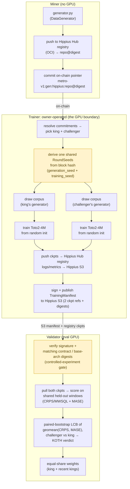

# cascade: SOTA time-series foundation models on Bittensor

cascade is building state-of-the-art time-series foundation models (TSFM) on
Bittensor. We start where the leverage is: data. The first task holds the
model byte-identical so the only variable is data quality, and scores the data
generators that feed it — better synthetic data, better forecasters. The full
sequence is in the [technical roadmap](#technical-roadmap).

## Why compete on data

Synthetic data isn't cascade's *only* lever, but we believe high-quality
synthetic data is critical to training a time-series foundation model. That view
tracks the consensus direction of the field: recent models keep winning on
benchmarks by competing on synthetic priors, not architecture.

* Chronos-2 (Amazon, 120M) reaches state-of-the-art zero-shot accuracy on
  fev-bench, GIFT-Eval, and Chronos Benchmark II, trained heavily on
  *large-scale synthetic* series (Gaussian-process curves, trend/seasonality/
  irregularity mixtures, random temporal causal graphs)
  ([arXiv 2510.15821](https://arxiv.org/abs/2510.15821)). Their ablation
  trained *purely on synthetic data*, Chronos-2-Synth, stays within ~1 skill
  point of the full model on GIFT-Eval (50.4 vs 51.4) and Chronos Benchmark II
  (46.4 vs 46.6) — the authors note this suggests real data "may not even be
  required for effective pretraining."
* FlowState (IBM, 9.1M) is the smallest model in GIFT-Eval's top 10,
  out-forecasting rivals 20x+ its size, pretrained in part on synthetic series
  from the CauKer generator ([arXiv 2508.05287](https://arxiv.org/abs/2508.05287)).
* ForecastPFN is a prior-data fitted network trained purely on a synthetic
  distribution, and was the first zero-shot forecaster to beat the then-SOTA
  with *no* real training data at all
  ([arXiv 2311.01933](https://arxiv.org/abs/2311.01933)); TempoPFN
  ([arXiv 2510.25502](https://arxiv.org/abs/2510.25502)) carries the
  purely-synthetic pretraining recipe further.
* DynaMix (NeurIPS 2025) is trained on nothing but a narrow synthetic corpus
  of 34 chaotic dynamical systems and, with ~0.1% of Chronos's parameters
  (~10k in total), still beats Chronos zero-shot on real-world traffic and
  weather it never saw: a small, well-curated synthetic prior outperforming a far
  larger real-data model ([arXiv 2505.13192](https://arxiv.org/abs/2505.13192)).

The throughline: across the leaderboard, the synthetic data distribution is doing
the heavy lifting. cascade turns that distribution into the competitive surface,
holding the model fixed so miners compete the prior.

## How it works

The fixed process is a Toto2-4M backbone trained from random initialisation
([Datadog/Toto-2.0-4m](https://huggingface.co/Datadog/Toto-2.0-4m), arXiv
2605.20119), *not* a fine-tune of released weights. Training from scratch is the
point: the corpus is then the only source of learned signal, so the downstream
forecast skill measures the *data*, not what some pretrained checkpoint already
knew. Toto 2.0 itself is 57.5% synthetic data with zero public series in
pretraining and still tops GIFT-Eval, and cascade turns that synthetic-prior
design into an open competition.



> The highlighted boxes are where the controlled experiment lives: the trainer
> reuses one `RoundSeeds` for both runs, and the validator's digest gate rejects any
> manifest where king and challenger didn't share that contract. Details below.

The central invariant: in a round, the king's generator and the
challenger's generator are trained into models under a *byte-identical* contract:
the same Toto2 architecture and random initialisation, same compute budget,
optimiser, generation seed, and training seed. The only thing that differs is the
generator code. So the downstream eval is a controlled measurement of data
quality, not a confound of data + luck + hyperparameters. Because the run
starts from noise, the contract pins the *whole* recipe (see `chain.toml
[training]`). Each model trains for a fixed wall-clock budget (~3h on the
owner's reference GPU), enforced as a fixed token count (`hours × reference
throughput`) so king and challenger get identical compute. A raw timer would
let a generator win by emitting cheap-to-step data rather than better data, and
wouldn't reproduce on a re-derived audit run.

A challenger takes the throne by winning `dethrone_cp` round(s) by a
confidence-bounded margin (paired bootstrap LCB clears the win margin). The
shipped `chain.toml` sets `dethrone_cp = 1` with a flat, no-tenure margin
(`win_margin_start == win_margin_end`, `margin_warmup_rounds = 0`), so a single
decisive round dethrones and every king is equally challengeable; raise
`dethrone_cp` and re-enable the warmup for the sticky, tenure-weighted variant.
Weights are split equally across the current king plus up to `reward_prior_kings`
recent distinct kings still registered (burning to `burn_uid` if none are), with
`reward_prior_kings = 0` collapsing to pure winner-take-all.

## Why Toto2-4M

The fixed model is small *on purpose*. Toto 2.0 is the first time-series
foundation family to validate a clean scaling law across its sizes
(4M → 22M → 313M → 1B → 2.5B): by adopting u-μP (Maximal Update Parametrization),
the learning dynamics are tuned once on the 4M model and those exact
hyperparameters transfer to the 2.5B model, with predictive skill improving
monotonically and without saturation as you climb the ladder
([Datadog, Toto 2.0](https://www.datadoghq.com/blog/ai/toto-2/)). That makes the
4M backbone the cheapest rung of a curve known to behave: it trains from scratch
in hours, yet it sits on a scaling trajectory whose ordering is expected to hold
as the subnet scales the fixed model up. It is also no toy: the 4M is already
competitive with Toto 1.0 and Chronos-2 despite being ~30-40x smaller. A robust,
predictable, inexpensive starting point is exactly what a per-round controlled
experiment needs.

## Technical roadmap

cascade ships the first phase of a longer program. The sequence is deliberate:
prove data quality is *measurable and competable* before handing miners the much
larger, noisier surface of training the models themselves.

* Phase 1 — Compete on data (now). The model is byte-identical; the only
  variable is the synthetic data generator. This is the subnet shipping today —
  everything else in this README describes it. The bet: better synthetic data
  produces better forecasters, and we can measure that cleanly per round.
* Phase 2 — Prove it scales. Show the data advantage *survives model scale*.
  µP lets hyperparameters tuned once at the 4M rung transfer up the ladder, and
  optimal data mixtures are roughly size-independent — so we rank the recipe
  cheaply at the small model and predict large-model skill before paying for it.
* Phase 3 — Open model training. Once data quality is a solved, measurable
  axis, widen the contract so miners compete on the models too.
* North star — multimodal. Forecasting that reads and writes across
  modalities: time series ↔ language ↔ vision.

## Three roles

| role | package | needs GPU | needs chain |
|------|---------|-----------|-------------|
| miner | `cascade.miner` | no | to deploy |
| trainer (owner) | `cascade.trainer` | yes | to read king / sign manifest |
| validator | `cascade.validator` | yes (eval) | to set weights |

## Layout

```
cascade/
  interface/   miner-facing contract (DataGenerator ABC, output checks, static guard)
  eval/        scoring math: CRPS (MWSQL), MASE, paired bootstrap, KOTH decision
  trainer/     owner GPU service: corpus build, fixed contract, train+upload, manifest
  validator/   manifest gate, checkpoint evaluator, KOTH state machine, weights
  miner/       miner CLI: verify, deploy (push to Hippius Hub registry + commit)
  shared/      config loader, Hippius Hub registry/S3, chain client, manifest schema

docs/
  ARCHITECTURE.md   end-to-end flow, trust model, the controlled-experiment invariant
  INTERFACE.md      the DataGenerator submission contract for miners
scripts/
  example_generator/   a forkable reference generator (also a test fixture)
```

## Console scripts

After `uv sync` / `pip install -e .`:

* `cascade verify <repo_dir>`: runs every check the trainer runs (layout,
  static guard, hash-locked deps, and the determinism check: your generator
  must produce a byte-identical corpus at a fixed seed).
* `cascade deploy <repo_dir> --hub-repo <ns/name> --wallet-name ... --wallet-hotkey ...`:
  verifies the local generator, pushes it to the Hippius Hub registry (OCI),
  and commits `metro-v1:gen:hippius:<repo>@<digest>` on-chain (the OCI digest pins
  the content — no git SHA).
* `cascade-trainer --trainer cascade.trainer.toto2_trainer:Toto2Trainer`:
  the owner training service (`--offline` for a config/seed smoke); the reference
  Toto2-4M backend lives in `cascade.trainer.toto2_trainer`. Add
  `--remote-hosts hosts.toml` to train the king and challenger in parallel on
  separate SSH GPU pods (Lium/Targon); see `scripts/remote_hosts.example.toml`.
* `cascade-train-worker`: the per-pod worker the remote dispatch runs (trains
  one role, uploads its checkpoint, prints a receipt — no wallet on the pod).
* `cascade-validator`: the validator loop (`--offline` for a state smoke).

Storage is Hippius: models/checkpoints/generators on the Hippius Hub
registry (OCI, pinned by `repo@digest`), manifests + training logs on Hippius
S3. Install the extra (`pip install -e '.[hippius]'`) and set the env
credentials (`HIPPIUS_S3_ACCESS_KEY` / `HIPPIUS_S3_SECRET_KEY`, and a Hub token
`HIPPIUS_HUB_TOKEN` or `HIPPIUS_HUB_USERNAME` + `HIPPIUS_HUB_PASSWORD`).

Before launching, set `chain.toml [subnet] netuid`, `[training] base_arch_digest`
(sha256 of the frozen base architecture), `[manifest] trainer_hotkey`, `[eval]
window_pool` (the held-out pool's Hub `repo@digest`), and `[storage]` endpoints.

## Quick start

```bash
pip install -e .                 # core: numpy + scipy only
pip install -e '.[dev]'          # + pytest/ruff/hypothesis
python -m pytest tests/unit -q   # CPU tests, no torch/HF/chain needed
```

The heavy stacks are optional extras, pulled in only where needed:
`.[train]` (torch/transformers for the trainer + validator evaluator),
`.[hippius]` (Hippius Hub registry + S3 + `huggingface_hub`), and `.[chain]`
(bittensor).

The Toto2-4M from-scratch training sits behind the
`cascade.trainer.contract.BaseTrainer` protocol (the GPU boundary). A runnable
reference implementation ships in `cascade.trainer.toto2_trainer` (a causal
patch transformer with a 9-quantile pinball head, trained from random init under
the `chain.toml [training]` recipe); it needs a GPU to validate end-to-end, so
run it on your reference box before pinning `base_arch_digest`. Everything above
that boundary is numpy/CPU and tested. See `docs/ARCHITECTURE.md`.

## License

MIT
