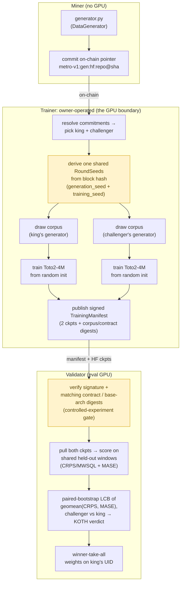

# metronome: synthetic time-series data subnet

A Bittensor subnet where miners compete on the quality of **training data**, not
models. It is the dual of [`horizon`](../horizon): horizon scores trained TSFMs
that miners submit; metronome holds the *training process* fixed and scores the
**data generators** that feed it.

The fixed process is **a Toto2-4M backbone trained from random initialisation**
([Datadog/Toto-2.0-4m](https://huggingface.co/Datadog/Toto-2.0-4m), arXiv
2605.20119), *not* a fine-tune of released weights. Training from scratch is the
point: the corpus is then the only source of learned signal, so the downstream
forecast skill measures the *data*, not what some pretrained checkpoint already
knew. Toto 2.0 itself is 57.5% synthetic data with zero public series in
pretraining and still tops GIFT-Eval, and metronome turns that synthetic-prior
design into an open competition.

## How it works



> The **highlighted boxes** are where the controlled experiment lives: the trainer
> reuses one `RoundSeeds` for both runs, and the validator's digest gate rejects any
> manifest where king and challenger didn't share that contract. Details below.

The **central invariant**: in a round, the king's generator and the
challenger's generator are trained into models under a *byte-identical* contract:
the same Toto2 architecture and random initialisation, same compute budget,
optimiser, generation seed, and training seed. The only thing that differs is the
generator code. So the downstream eval is a controlled measurement of **data
quality**, not a confound of data + luck + hyperparameters. Because the run
starts from noise, the contract pins the *whole* recipe (see `chain.toml
[training]`). Each model trains for a fixed **wall-clock budget (~3h on the
owner's reference GPU)**, enforced as a fixed token count (`hours × reference
throughput`) so king and challenger get **identical compute**. A raw timer would
let a generator win by emitting cheap-to-step data rather than better data, and
wouldn't reproduce on a re-derived audit run.

A challenger only takes the throne after winning **`dethrone_cp` consecutive
rounds** by a confidence-bounded margin (paired bootstrap LCB clears the
tenure-adjusted win margin). Weights are pure winner-takes-all.

## Why Toto2-4M

The fixed model is small *on purpose*. Toto 2.0 is the first time-series
foundation family to **validate a clean scaling law** across its sizes
(4M → 22M → 313M → 1B → 2.5B): by adopting u-μP (Maximal Update Parametrization),
the learning dynamics are tuned **once on the 4M model** and those exact
hyperparameters transfer to the 2.5B model, with predictive skill improving
monotonically and without saturation as you climb the ladder
([Datadog, Toto 2.0](https://www.datadoghq.com/blog/ai/toto-2/)). That makes the
4M backbone the cheapest rung of a curve known to behave: it trains from scratch
in hours, yet it sits on a scaling trajectory whose ordering is expected to hold
as the subnet scales the fixed model up. It is also no toy: the 4M is already
competitive with Toto 1.0 and Chronos-2 despite being ~30-40x smaller. A robust,
predictable, inexpensive starting point is exactly what a per-round controlled
experiment needs.

## Why compete on data

Synthetic data isn't metronome's *only* lever, but we believe **high-quality
synthetic data is critical** to training a time-series foundation model. That view
tracks the consensus direction of the field: recent models keep winning on
benchmarks by competing on synthetic priors, not architecture.

* **Chronos-2** (Amazon, 120M) reaches state-of-the-art zero-shot accuracy on
  fev-bench, GIFT-Eval, and Chronos Benchmark II, trained heavily on
  *large-scale synthetic* series (Gaussian-process curves, trend/seasonality/
  irregularity mixtures, random temporal causal graphs)
  ([arXiv 2510.15821](https://arxiv.org/abs/2510.15821)).
* **FlowState** (IBM, 9.1M) is the smallest model in GIFT-Eval's top 10,
  out-forecasting rivals 20x+ its size, pretrained in part on synthetic series
  from the **CauKer** generator ([arXiv 2508.05287](https://arxiv.org/abs/2508.05287)).
* **ForecastPFN** is a prior-data fitted network trained **purely on a synthetic
  distribution**, and was the first zero-shot forecaster to beat the then-SOTA
  with *no* real training data at all
  ([arXiv 2311.01933](https://arxiv.org/abs/2311.01933)); **TempoPFN**
  ([arXiv 2510.25502](https://arxiv.org/abs/2510.25502)) carries the
  purely-synthetic pretraining recipe further.
* **DynaMix** (NeurIPS 2025) is trained on nothing but a narrow synthetic corpus
  of 34 chaotic dynamical systems and, with **~0.1% of Chronos's parameters**
  (~10k in total), still beats Chronos zero-shot on real-world traffic and
  weather it never saw: a small, well-curated synthetic prior outperforming a far
  larger real-data model ([arXiv 2505.13192](https://arxiv.org/abs/2505.13192)).

The throughline: across the leaderboard, the synthetic data distribution is doing
the heavy lifting. metronome turns that distribution into the competitive surface,
holding the model fixed so miners compete the prior.

## Three roles

| role | package | needs GPU | needs chain |
|------|---------|-----------|-------------|
| **miner** | `metronome.miner` | no | to deploy |
| **trainer** (owner) | `metronome.trainer` | yes | to read king / sign manifest |
| **validator** | `metronome.validator` | yes (eval) | to set weights |

## Layout

```
metronome/
  interface/   miner-facing contract (DataGenerator ABC, output checks, static guard)
  eval/        scoring math: CRPS (MWSQL), MASE, paired bootstrap, KOTH decision
  trainer/     owner GPU service: corpus build, fixed contract, train+upload, manifest
  validator/   manifest gate, checkpoint evaluator, KOTH state machine, weights
  miner/       miner CLI: verify, deploy
  shared/      config loader, HF fetch/upload, chain client, manifest schema

docs/
  ARCHITECTURE.md   end-to-end flow, trust model, the controlled-experiment invariant
  INTERFACE.md      the DataGenerator submission contract for miners
scripts/
  example_generator/   a forkable reference generator (also a test fixture)
```

## Console scripts

After `uv sync` / `pip install -e .`:

* `metronome verify <repo_dir>`: runs every check the trainer runs (layout,
  static guard, hash-locked deps, **and the determinism check**: your generator
  must produce a byte-identical corpus at a fixed seed).
* `metronome deploy <hf_repo> --revision <40-char-sha> --wallet-name ... --wallet-hotkey ...`:
  commits `metro-v1:gen:hf:<repo>@<sha>` on-chain.
* `metronome-trainer`: the owner training service (`--offline` for a config/seed smoke).
* `metronome-validator`: the validator loop (`--offline` for a state smoke).

Before launching, set `chain.toml [subnet] netuid`, `[training] base_arch_digest`
(sha256 of the frozen base architecture), `[manifest] trainer_hotkey`, and the
repo identifiers.

## Quick start

```bash
pip install -e .                 # core (numpy/scipy/huggingface-hub)
pip install -e '.[dev]'          # + pytest/ruff
python -m pytest tests/unit -q   # pure-numpy tests, no torch/HF/chain needed
```

The Toto2-4M from-scratch training is the **owner's** to implement behind the
`metronome.trainer.contract.BaseTrainer` protocol (the GPU boundary); see
`docs/ARCHITECTURE.md`. Everything above that boundary is numpy/CPU and tested.

## License

MIT
